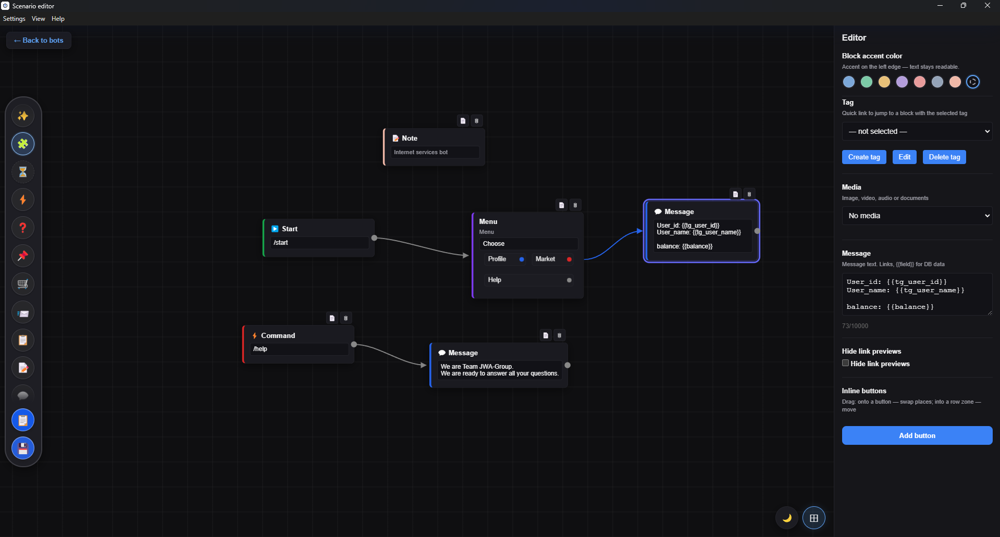
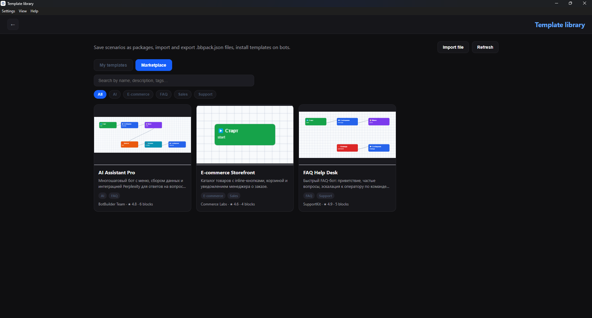
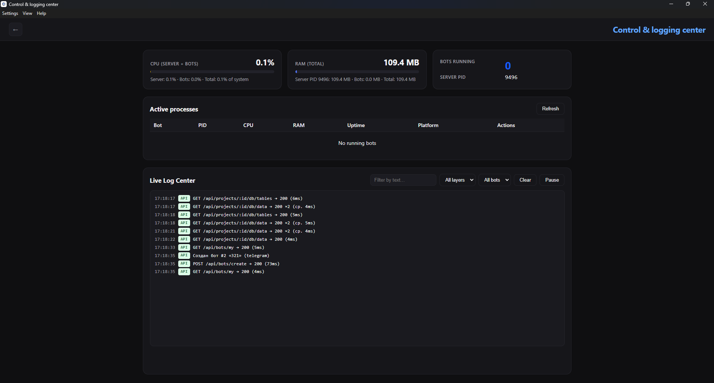
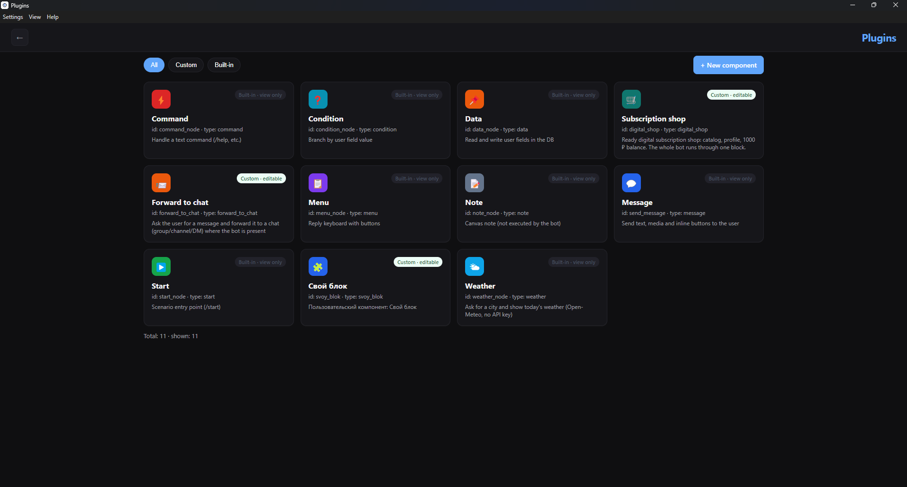
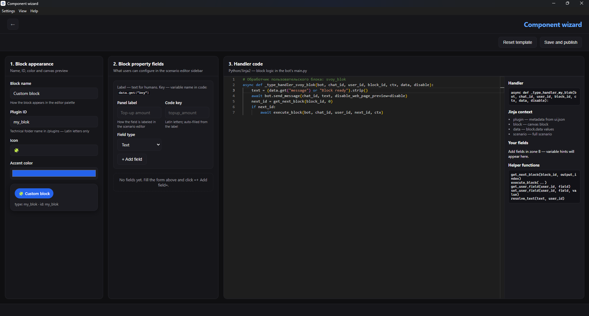

# BotBuilder

| Field | Value |
|-------|-------|
| License | Elastic License v2 |
| Operating System | Windows 10 / 11 (x64) |
| Core Stack | Electron 33, FastAPI, Python 3 (embedded), SQLite |

Desktop IDE for designing, compiling, and deploying Telegram chat bots from visual node-based scenarios. Build complex, local-first automations without subscription fees.
[-brightgreen?style=for-the-badge&logo=windows)](https://github.com/JWA-Group/BotBuilder/releases/latest)

---

## Technical Overview

BotBuilder is a hybrid desktop application: an Electron shell hosts the user interface while a local FastAPI sidecar provides the API, compilation pipeline, and data layer. All network traffic between the renderer and backend is confined to `127.0.0.1`.

### Core Capabilities

| Capability | Description |
|------------|-------------|
| **Node Editor** | Visual scenario editor with drag-and-drop blocks, connection routing, undo history, and live property editing in a dedicated sidebar. |
| **Ecosystem Sync** | Bundled plugin catalog, user-authored custom blocks, template library, and cloud marketplace packs share a unified import and deployment workflow. |
| **Data Privacy** | User projects, databases, plugins, and settings are stored under `%AppData%\botbuilder-desktop\` and are never written into the installation directory. |
| **Localization Engine** | Full UI localization (English, Russian, Spanish) with runtime language switching, cross-window IPC synchronization, and plugin metadata translation. |

---

## Visual Demonstration

<table width="100%">
  <tr>
    <td align="center" width="50%">
      
      <br><sub>Scenario editor</sub>
    </td>
    <td align="center" width="50%">
      
      <br><sub>Template library</sub>
    </td>
  </tr>
</table>

<br>

<p align="center">
  
  <br><sub>Control & logging center</sub>
</p>

<br>

<table width="100%">
  <tr>
    <td align="center" width="50%">
      
      <br><sub>Plugins</sub>
    </td>
    <td align="center" width="50%">
      
      <br><sub>Component wizard</sub>
    </td>
  </tr>
</table>

## For Users

### Quick Start

1. Download `BotBuilder-Setup-{version}.exe` from the release artifacts.
2. Run the installer. Read and accept the End User License Agreement (EULA) on the mandatory license page before proceeding.
3. Choose an installation directory (default: `C:\Program Files\BotBuilder`).
4. Launch BotBuilder from the desktop shortcut or Start Menu.
5. On first run, select your interface language and appearance theme, then click **Continue**.
6. Open **Bots**, create a bot, and launch the **Scenario Editor** to begin building a workflow.

For detailed installation steps, interface reference, and marketplace usage, see [docs/USER_GUIDE.md](docs/USER_GUIDE.md).

---

## For Developers

### Architectural Highlights

| Component | Summary |
|-----------|---------|
| **Asynchronous IPC Bridge** | Electron Main spawns and supervises a FastAPI sidecar process. The renderer communicates exclusively via HTTP to `127.0.0.1:{port}/api`. Health checks, graceful shutdown, and port conflict resolution are handled in the main process. |
| **Zero-Dependency Runtime** | Customer bot scripts execute through a bundled `python_embed` interpreter shipped with the installer. No system-wide Python installation is required in production. |
| **Dynamic Plugin Subsystem** | Block plugins are discovered at runtime from filesystem directories. Each plugin exposes `ui.json` metadata and a Jinja2 code template; user plugins override bundled definitions without recompilation of the shell. |
| **Layout Performance** | The scenario canvas batches DOM and SVG updates through `requestAnimationFrame`, coalesces connection redraws, and applies transform-based pan/zoom to avoid layout thrashing during drag operations. |

Full system design, path isolation model, and frontend performance strategy: [docs/ARCHITECTURE.md](docs/ARCHITECTURE.md).

### Build Commands

```bash
npm install
npm run build:prod
```

Output: `dist-electron/BotBuilder-Setup-{version}.exe`

---

## 🗺️ Roadmap

We are actively expanding BotBuilder to become the ultimate multi-channel visual automation hub. 

- [x] **Phase 1:** Core Node Engine & Runtime compiler (Telegram Support)
- [ ] **Phase 2:** Linux & macOS cross-platform support (AppImage / DMG builds)
- [ ] **Phase 3:** **WhatsApp Business API** integration layer
- [ ] **Phase 4:** **Instagram Graph API** direct messaging nodes
- [ ] **Phase 5:** Native Telegram WebApps (Mini Apps) drag-and-drop builder

---

## License Summary

BotBuilder is distributed under the **Elastic License v2**. You may use, copy, and modify the software subject to the license terms. Redistribution of the compiled installer for commercial resale is prohibited without a separate agreement.

Third-party dependency licenses are bundled in the installer at `resources/licenses/ThirdPartyNotices.txt`. The installer EULA presented during setup is located at `backend/build/LICENSE.txt`.

For the complete license text, refer to the [Elastic License 2.0](https://www.elastic.co/licensing/elastic-license) or the EULA displayed during installation.
